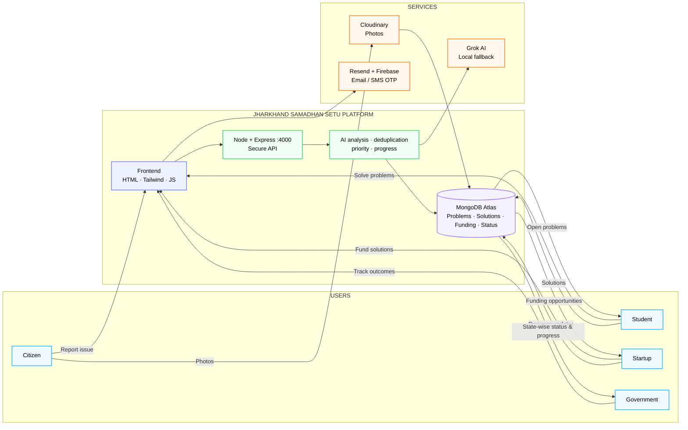

# JharkhandSamadhanSetu

> Civic grievance and collaboration API connecting citizens, institutions, and solution providers.

   

## 📑 Table of Contents

- [Description](#description)
- [Key Features](#key-features)
- [Use Cases](#use-cases)
- [Tech Stack](#tech-stack)
- [Architecture](#architecture)
- [Quick Start](#quick-start)
- [Key Dependencies](#key-dependencies)
- [Available Scripts](#available-scripts)
- [API Endpoints](#api-endpoints)
- [Project Structure](#project-structure)
- [Development Setup](#development-setup)
- [Contributors](#contributors)
- [Contributing](#contributing)

## 📝 Description

JharkhandSamadhanSetu is a civic problem-solving backend service designed to streamline the reporting, tracking, and resolution of community issues. It acts as an integration layer between citizens reporting grievances and external entities—including universities, startups, enterprises, and local authorities—working collaboratively to address localized problems.

The backend is built using Node.js and Express, backed by MongoDB through Mongoose for data persistence. It routes problem submissions, manages user accounts and authentication, coordinates organizational matches, and facilitates collaboration records. The system integrates Multer with Cloudinary for handling and storing image evidence attached to reports, and uses Resend for transactional email communications.

Designed for community-driven problem resolution, the API enforces secure request flows with Helmet, Express Rate Limit, and strict environment configuration checks, providing a dependable foundation for civic portals and institutional partner dashboards.

## ✨ Key Features

- **📸 Cloudinary Evidence Uploads** — Processes and stores grievance photographic evidence via Multer and Cloudinary storage integrations.
- **🤝 Stakeholder Collaboration Routing** — Provides dedicated API routes for managing engagements between citizens, universities, startups, and enterprises.
- **📬 Transactional Email Delivery** — Integrates with the Resend API to dispatch automated notifications and communications.
- **🛡️ API Protection and Hardening** — Secures public endpoints using Helmet headers, Express rate limiting, and CORS validation.
- **📊 Grievance and Match Analytics** — Exposes statistical and match routes to track civic problem status and organizational pairings.

## 🎯 Use Cases

- Powering citizen reporting portals with image evidence upload capabilities for local municipal issues.
- Matching civic problems with academic researchers, enterprises, or startups interested in implementing solutions.
- Tracking problem life-cycles and collaboration statuses across administrative and organizational stakeholders.
- Aggregating resolution metrics and community grievance statistics for civic reporting dashboards.

## 🛠️ Tech Stack

  

**Notable libraries:** Mongoose, Multer, Resend

## 🏗️ Architecture

A high-level view of how the main pieces fit together:



## ⚡ Quick Start

```bash

# 1. Clone the repository
git clone https://github.com/shohan-offcdr/JharkhandSamadhanSetu.git

# 2. Install dependencies
npm install

# 3. Start the dev server
npm run dev
```

## 📦 Key Dependencies

```
@google/generative-ai: ^0.24.1
cloudinary: ^2.5.1
cors: ^2.8.5
dotenv: ^16.4.5
express: ^4.21.2
express-rate-limit: ^8.7.0
helmet: ^8.3.0
mongoose: ^8.8.3
multer: ^1.4.5-lts.1
resend: ^4.0.1
```

## 🚀 Available Scripts

- **dev** — `npm run dev`
- **start** — `npm run start`
- **seed** — `npm run seed`
- **check** — `npm run check`

## 🌐 API Endpoints

Detected endpoints (best-effort scan):

```
GET /api/health
GET /api/ready
GET /api/version
```

## 📁 Project Structure

```
.
├── implementation_plan.md
├── server
│   ├── package.json
│   ├── scripts
│   │   └── seed.js
│   └── src
│       ├── app.js
│       ├── config
│       │   ├── cloudinary.js
│       │   ├── db.js
│       │   └── resend.js
│       ├── middleware
│       │   ├── requireAccount.js
│       │   └── upload.js
│       ├── models
│       │   ├── Account.js
│       │   ├── Citizen.js
│       │   ├── Collaboration.js
│       │   ├── EmailOtp.js
│       │   ├── EnterpriseCsr.js
│       │   ├── Match.js
│       │   ├── Problem.js
│       │   ├── Solution.js
│       │   ├── StartupProfile.js
│       │   └── University.js
│       ├── routes
│       │   ├── accounts.js
│       │   ├── auth.js
│       │   ├── citizens.js
│       │   ├── collaborations.js
│       │   ├── enterprises.js
│       │   ├── matches.js
│       │   ├── problems.js
│       │   ├── solutions.js
│       │   ├── startups.js
│       │   ├── stats.js
│       │   ├── universities.js
│       │   └── upload.js
│       ├── server.js
│       ├── services
│       │   ├── aiAnalyzer.js
│       │   ├── aiConfig.js
│       │   ├── aiFactors.js
│       │   ├── aiMetrics.js
│       │   ├── analysisQueue.js
│       │   ├── analyzeHelpers.js
│       │   ├── circuitBreaker.js
│       │   ├── embeddingService.js
│       │   ├── matchEngine.js
│       │   ├── providerError.js
│       │   └── providers
│       │       ├── __tests__
│       │       │   └── ...
│       │       ├── geminiProvider.js
│       │       └── grokProvider.js
│       └── utils
│           ├── asyncHandler.js
│           ├── categorize.js
│           ├── otp.js
│           ├── password.js
│           ├── security.js
│           └── token.js
└── site
    ├── admin
    │   ├── ai-analysis.html
    │   ├── dashboard.html
    │   ├── login.html
    │   ├── priority-queue.html
    │   └── problem-management.html
    ├── citizen
    │   ├── confirmation.html
    │   ├── grievance-step1.html
    │   ├── grievance-step2.html
    │   ├── grievance-step3.html
    │   ├── grievance-step4.html
    │   ├── login.html
    │   └── register.html
    ├── government
    │   ├── ai-analysis.html
    │   ├── industry-csr-management.html
    │   ├── login.html
    │   ├── overview-dashboard.html
    │   ├── priority-queue.html
    │   ├── problem-management.html
    │   └── university-management.html
    ├── index.html
    ├── js
    │   ├── api.js
    │   ├── firebase-config.js
    │   ├── mock-data.js
    │   └── shared.js
    ├── startup
    │   ├── browse-problems.html
    │   ├── collaboration-workspace.html
    │   ├── company-profile.html
    │   ├── dashboard.html
    │   ├── impact-dashboard.html
    │   ├── login.html
    │   ├── project-details.html
    │   └── project-tracking.html
    └── student
        ├── dashboard.html
        ├── login.html
        ├── milestone-tracker.html
        ├── problem-view.html
        ├── proposal-submission.html
        └── team-formation.html
```

## 🛠️ Development Setup

### Node.js / JavaScript
1. Install Node.js (v18+ recommended)
2. Install dependencies: `npm install` (or `yarn` / `pnpm install` / `bun install`)
3. Start the dev server: see the **Quick Start** above

## 👥 Contributors

Thanks to everyone who has contributed to this project:

<p align="left">
<a href="https://github.com/shohan-offcdr" title="shohan-offcdr"></a>
</p>

[See the full list of contributors →](https://github.com/shohan-offcdr/JharkhandSamadhanSetu/graphs/contributors)

## 👥 Contributing

Contributions are welcome! Here's the standard flow:

1. **Fork** the repository
2. **Clone** your fork: `git clone https://github.com/shohan-offcdr/JharkhandSamadhanSetu.git`
3. **Branch**: `git checkout -b feature/your-feature`
4. **Commit**: `git commit -m 'feat: add some feature'`
5. **Push**: `git push origin feature/your-feature`
6. **Open** a pull request

Please follow the existing code style and include tests for new behavior where applicable.

---
